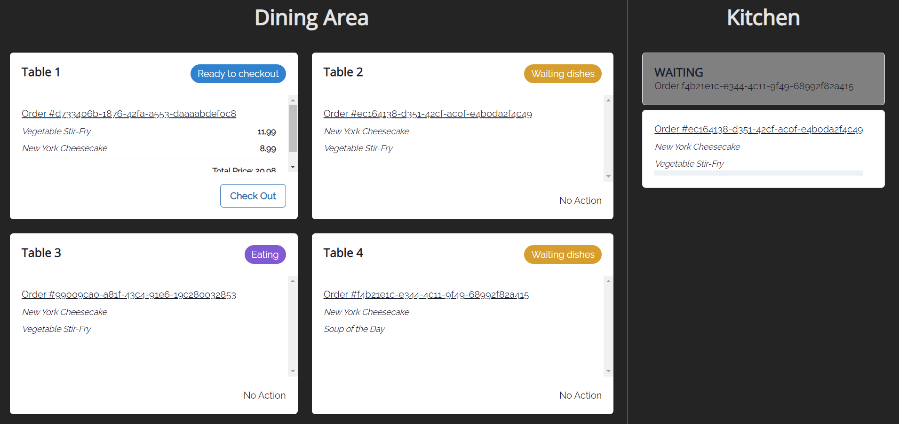
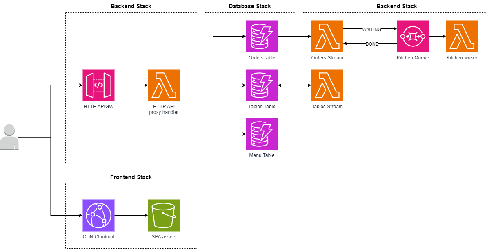
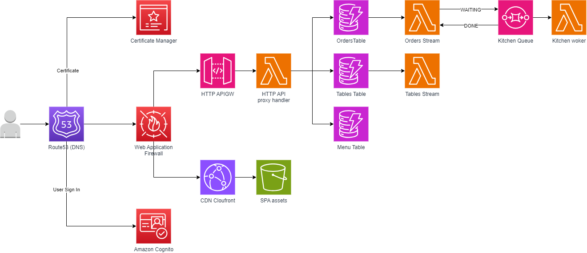

# aws-cdk-react-node-demo

This repository aims to demo and present a serverless deployment on AWS for a React SPA and its nodejs backend.

## Functional requirements

The demo application simulate an simple restaurant order system.
The application allows you to take orders from restaurant tables, then the orders go to the kitchen.
The kitchen prepares orders one by one, when an order is ready, it is available for the table and customers eat their dishes.
When a table has finished its meal, it is possible take the bill.



## Architecture on AWS

### Current



### Evolve



## Getting started

### Requirements

1. [Install Node.js 20+](https://nodejs.org/en/download/)
2. [Install pnpm](https://pnpm.io/fr/installation)
3. [Install AWS CLI](https://docs.aws.amazon.com/cli/latest/userguide/getting-started-install.html)
4. [Install AWS CDK](https://docs.aws.amazon.com/cdk/v2/guide/getting_started.html#getting_started_install)
5. [Setup and AWS account](https://docs.aws.amazon.com/accounts/latest/reference/welcome-first-time-user.html)
6. [(optional) Configure management account, create dev account and setup SSO](https://docs.aws.amazon.com/singlesignon/latest/userguide/useraccess.html#howtodelegatessoaccess)
7. [Configure AWS CLI](https://docs.aws.amazon.com/cli/latest/userguide/cli-chap-configure.html)
8. [Bootstrap the AWS account to use CDK](https://docs.aws.amazon.com/cdk/v2/guide/bootstrapping.html)
9. [Install Visual Studio Code](https://code.visualstudio.com/)
10. [Install Visual Studio Code recommended extensions][.vscode/extensions.json]

### Installation

1. Clone the repository
2. Install dependencies

```bash
pnpm i
```

### Build

```bash
pnpm build-backend # build packages/lambdas
pnpm build-frontend # build packages/webapp
pnpm build-infra # build packages/infra

pnpm build # build all
```

### Linting & Formating

```bash
pnpm lint # run eslint on all packages
pnpm lint-fix # try to fix eslint rules on all packages

pnpm format # run prettier on all packages
pnpm format-fix # try to fix prettier rules on all packages
```

### Deploy to AWS

```bash
pnpm run deploy-backend
pnpm run deploy-frontend
pnpm run deploy
```

#### First deployment

1. Invoke load-restaurant-datas functions to populate `Table` and `Menu` DynamoDB Tables

```bash
aws lambda invoke --function-name "$STAGE-restaurant-load-restaurant-datas-function" -
```

2. The demo application do not include custom domain name, after the first deployment, retrieve exports from stacks to configure the api endpoint on the webapp and access it from cloudfront.

```bash
# After first deployment, retrieve the backend base url
BACKEND_API_BASE_URL=$(aws cloudformation describe-stacks  --stack-name "$STAGE-restaurant-backend-stack" --query 'Stacks[0].Outputs[?ExportName==`restaurant-http-api-endpoint`].OutputValue' --output text)

# Add VITE_API_BASE_URL to the webapp configuration
echo "VITE_API_BASE_URL=$BACKEND_API_BASE_URL" > "./packages/webapp/.env.local"

# Redeploy the frontend
pnpm deploy-frontend

FRONTEND_DOMAIN_NAME=$(aws cloudformation describe-stacks  --stack-name "$STAGE-restaurant-frontend-stack" --query 'Stacks[0].Outputs[?ExportName==`restaurant-cloudfront-domain-name`].OutputValue' --output text)
```

3. Open a web browser and access the application at FRONTEND_DOMAIN_NAME

### Clean AWS account

```
pnpm run destroy
```

## Usefull links

- [CDK Best practices](https://docs.aws.amazon.com/cdk/v2/guide/best-practices.html)
- [CDK with typescript](https://docs.aws.amazon.com/cdk/v2/guide/work-with-cdk-typescript.html)
